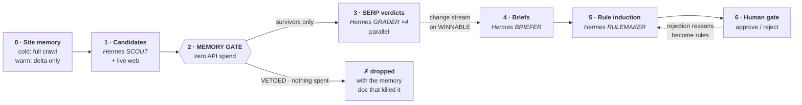
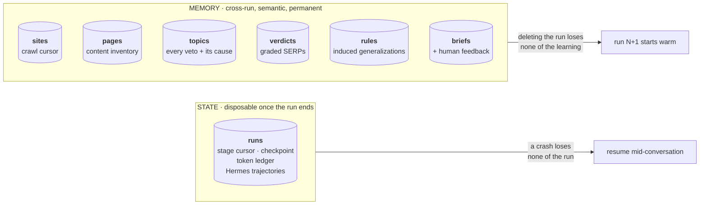
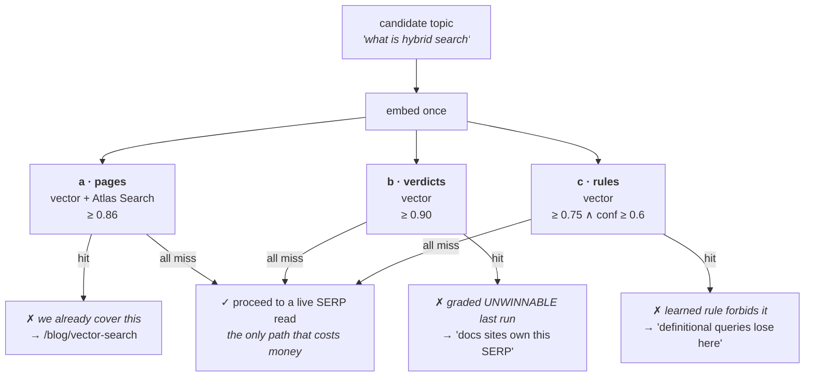
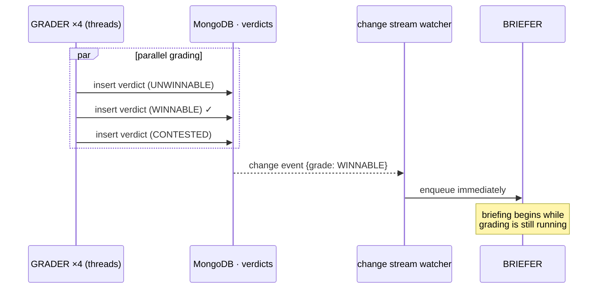
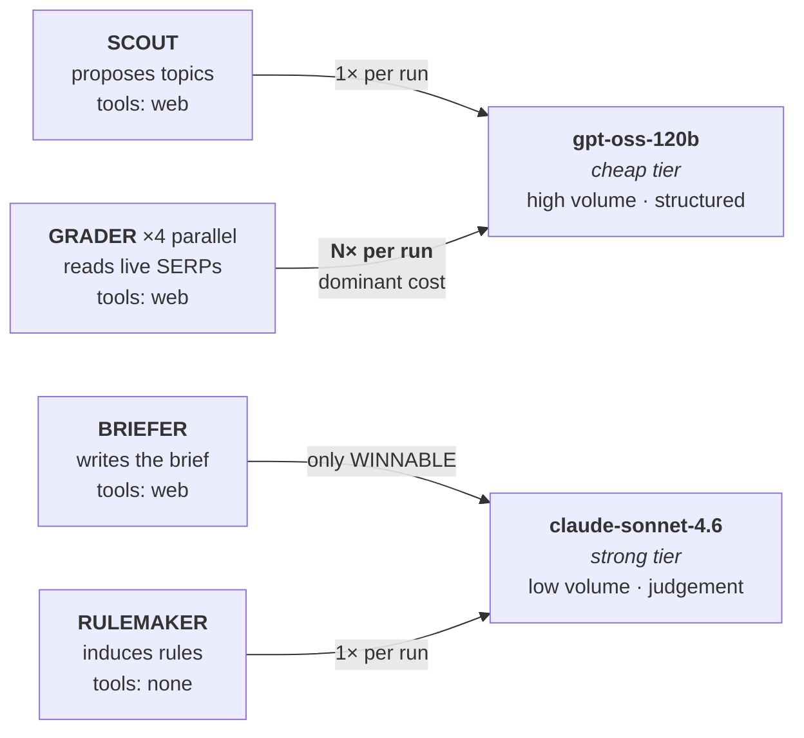

# cairn

**An SEO agent that gets cheaper and sharper every run, because MongoDB remembers what didn't work.**

Built at the MongoDB Persistent Context Sprint Hackathon · 2026-08-13

> A cairn is a stack of stones marking a trail, so the next traveler doesn't re-explore the dead ends.

---

## The thesis

Most AI SEO tools are stateless. Point one at your site twice and it does the same expensive research
twice, proposes the same topics, and cheerfully suggests an article you already published three
months ago.

Cairn stores every SERP verdict, every duplicate collision, and every human rejection in MongoDB —
then uses that memory to **veto work before paying for it**.

> The same candidate topic costs **~2,000 tokens** to evaluate on run 1 and **~0 tokens** on run 2,
> because the answer is already in MongoDB with its reasoning attached.

**This is the difference between RAG and memory.** A RAG app retrieves documents and stuffs them into
a prompt. Cairn retrieves and then **refuses to run the next stage**. Retrieval output here is
*control flow*, not prompt filler — which is also why this isn't another "basic RAG application."

---

## Architecture



**The only path that costs money runs through the gate.** Everything the system already knows is
answered from MongoDB for free.

Every stage checkpoints. `cairn run <domain> --resume <run_id>` continues mid-flight — including
resuming the Hermes agent **mid-conversation** from trajectories stored in MongoDB.

---

## How we use MongoDB

MongoDB isn't a log here. It is the component that **decides what the agent does next.**

### State and memory are deliberately separate



A crash loses none of the run. Deleting the run loses none of the learning.

### Five MongoDB capabilities, each load-bearing

| Capability | Collection | What it decides |
|---|---|---|
| **Vector Search** ×3 | `pages`, `verdicts`, `rules` | Three separate indexes serving three *distinct* veto decisions |
| **Atlas Search** | `pages` | The lexical half of cannibalization detection |
| **Change Streams** | `verdicts` | Briefing starts the instant a winner lands, not when the batch ends |
| **Atomic `$inc`** | `rules` | Confidence updates as a database write — auditable, can't hallucinate |
| **Aggregation** | `runs ⋈ briefs ⋈ topics` | Tokens per accepted brief, run over run — the headline metric |

#### 1. Three vector indexes, three different jobs

Most projects have one vector index and call it memory. Ours has three because there are three
genuinely different questions to ask before spending money:



Every veto writes the `_id` of the responsible document to `topics.vetoedBy`, so the terminal can
show **which stored fact killed which topic** — the thing that makes memory legible instead of magic.

#### 2. Hybrid search, because cannibalization needs two signals

Cannibalization — two of your own pages fighting over one intent — is genuinely a two-signal problem,
and either signal alone misses half the cases:

- **Vector** catches *same intent, different words*: `"hybrid search"` vs `"combining BM25 and vectors"`
- **Atlas Search** catches *literal keyword collision* on `targetKeyword`, which a semantic model
  often scores as merely similar rather than identical

```python
# gate.py — the lexical half, fuzzy so near-miss keyword targets still collide
{"$search": {
    "index": "pages_text",
    "compound": {
        "filter": [{"equals": {"path": "site", "value": site}}],
        "must":   [{"text": {"query": query,
                             "path": ["targetKeyword", "title", "h1"],
                             "fuzzy": {"maxEdits": 1}}}]}}}
```

#### 3. Change streams decouple grading from briefing

Verdict grading fans out across a thread pool. Rather than making the brief stage wait for the
slowest grader, a watcher on `verdicts` pushes each WINNABLE verdict downstream the moment it's
inserted:



The `$match` lives inside the pipeline, so the server filters and only winners cross the wire.
Where change streams aren't available, the watcher falls back to polling.

#### 4. Learning is a database write, not an LLM output

Rule confidence is never something a model asserts about itself. When induction produces a rule that
already exists semantically (≥ 0.93), we reinforce rather than duplicate:

```python
# store.py
db.rules.update_one({"_id": near[0]["_id"]},
                    {"$inc":  {"confidence": 0.05, "timesConfirmed": 1},
                     "$push": {"evidenceIds": run_id}})
```

Confidence is auditable, monotonic in evidence, and cannot inflate itself. Rules below 0.6 never fire.

#### 5. One aggregation is the whole scoreboard

`cairn stats` joins `runs` against `briefs` and `topics` to produce the number the project lives or
dies on — **tokens per accepted brief, falling run over run.** Shape of the output:

| run | start | considered | vetoed by memory | briefs | tokens | tokens/brief |
|---|---|---|---|---|---|---|
| `a1b2c3d4` | cold | 12 | 0 | 3 | … | … |
| `e5f6g7h8` | warm | 12 | 7 | 3 | … | … |

The `vetoed by memory` column going up while `tokens/brief` goes down *is* the project working.

---

## Multi-model, multi-agent architecture

Four specialized Hermes agents, each with its own system prompt, its own toolset, and — critically —
**its own model tier.** Grading a SERP is high-volume, structured, and cheap to get right. Writing a
brief is low-volume and quality-sensitive. Paying frontier prices for the former funds nothing.



| Role | Model tier | Why |
|---|---|---|
| `SCOUT` | cheap | Generates a list against a supplied inventory. Structured, bounded. |
| `GRADER` | cheap | Runs **N× per run** in parallel. The dominant cost centre — and reading a SERP is perception, not judgement. |
| `BRIEFER` | strong | Runs only for WINNABLE topics. Differentiated angle and information gain are exactly where model quality shows. |
| `RULEMAKER` | strong | Once per run. Bad generalizations poison every future run, so this is the worst possible place to economize. |

Every tier is overridable — `CAIRN_VERDICT_MODEL`, `CAIRN_BRIEF_MODEL`, `CAIRN_RULE_MODEL` — so the
routing is a default, not a hard-coding.

### What we turned *off* in Hermes is the point

```python
AIAgent(
    model=self.model,
    enabled_toolsets=["web"],      # live SERP reads, with tool retries handled for us
    ephemeral_system_prompt=...,   # the role
    skip_memory=True,              # ← MongoDB is the memory
    skip_context_files=True,       # ←
    skip_background_review=True,
    quiet_mode=True,
)
```

**We replaced Hermes's private, local, single-session memory with a shared, queryable, cross-run
memory in MongoDB.** Hermes supplies reasoning and web tools; everything it durably learns lives in
Atlas, where the next run — on any machine, by any teammate — can query it.

Two further details that matter:

- **`run_conversation()` returns the full message list**, which we persist to `runs.trajectories` and
  replay via `conversation_history=` on resume. A resumed run picks up *mid-conversation* with its
  reasoning intact, rather than restarting the stage from a cold prompt.
- **A fresh `AIAgent` per thread.** Instances aren't thread-safe, so the grader pool constructs one
  per worker. `task_id` is set to `{run_id}:{stage}` so every Hermes call correlates back to a document.

---

## The SEO, specifically

Real practitioner mechanics, not heuristics invented to make a demo work:

- **Cannibalization detection.** Two of your own pages competing for one intent splits link equity and
  confuses the ranker. It's the most valuable thing an AI content pipeline can do — and the thing they
  universally fail at, because they publish the collision.
- **SERP difficulty read.** If official documentation and Wikipedia own a definitional query, a
  marketing site does not win it. The grader reads what actually ranks and in which *format*.
- **Intent matching.** Informational / commercial-investigation / transactional. Mismatch means no rank
  regardless of content quality.
- **Topical authority.** Only pursue topics adjacent to clusters the site already covers, derived from
  the `pages` embeddings rather than asserted.
- **Internal links that are real.** Brief link targets are retrieved from the site's own inventory by
  vector search. They came out of the database, so they cannot be hallucinated.

The output is a **brief, not a draft.** The human gate stays before publication — automating research
is one thing, blindly publishing is where quality drift and SEO self-harm start.

---

## Setup

Requires Python 3.12 and [uv](https://docs.astral.sh/uv/).

```bash
git clone <this repo> && cd cairn

# Hermes ships no wheel, so vendor it from source:
git clone --depth 1 https://github.com/NousResearch/hermes-agent.git vendor/hermes-agent

uv sync
cp .env.example .env      # MONGODB_URI + OPENROUTER_API_KEY (+ VOYAGE_API_KEY)

uv run cairn doctor       # verify credentials, connectivity, change-stream support
uv run cairn init --wait  # create collections and Atlas search indexes
```

## Use

```bash
uv run cairn run example.com                     # full pipeline
uv run cairn run example.com --resume <run_id>   # continue after a crash
uv run cairn review example.com                  # approve/reject; rejections become rules
uv run cairn memory example.com                  # what the system has learned
uv run cairn stats example.com                   # tokens per brief, run over run
uv run cairn reset example.com                   # wipe memory, to demo a cold start again
```

## Degradation

Nothing hard-blocks on a missing optional dependency:

| Missing | Fallback | Cost |
|---|---|---|
| Atlas vector index still building | Exact cosine scan in `_exact_knn` | Milliseconds at these corpus sizes |
| `VOYAGE_API_KEY` | Deterministic hashed bag-of-words | **Lexical similarity only** — measured 0.507 on a near-duplicate pair against a 0.86 threshold, so semantic dedupe won't fire. Fine for a smoke test, not for a real run. |
| Change streams | Polling the `verdicts` collection | ~1s added latency |
| Atlas Search index | Vector half of the gate still runs | Loses literal-keyword collision detection |

The vector-index fallback matters more than it looks: silently returning zero matches would read as
*"no duplicates found"*, which is the most dangerous possible failure mode for this system.

## License

MIT
