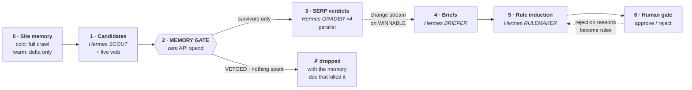
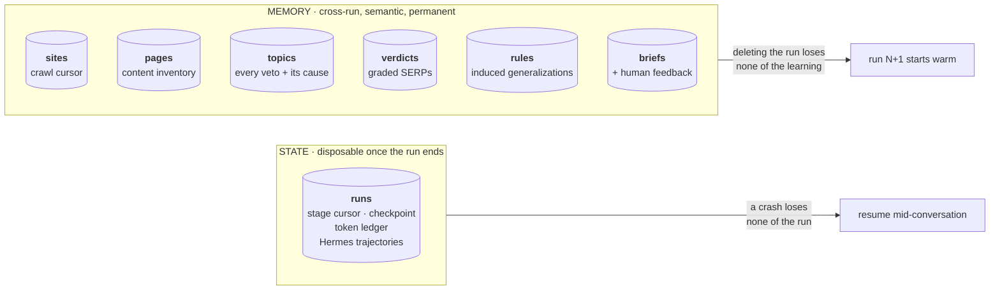
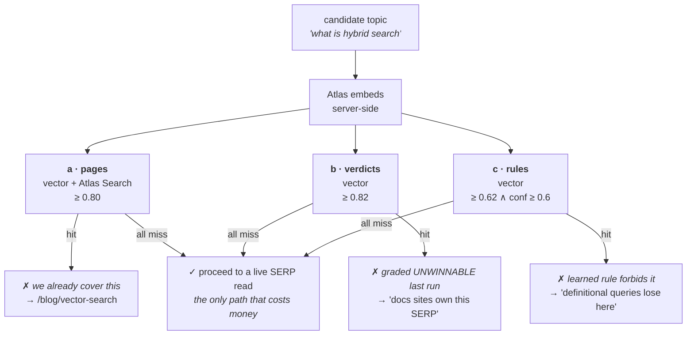
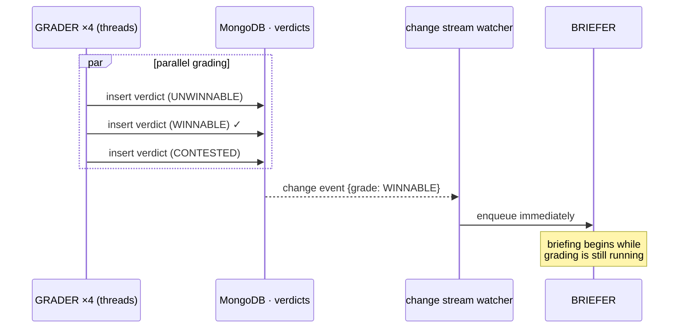
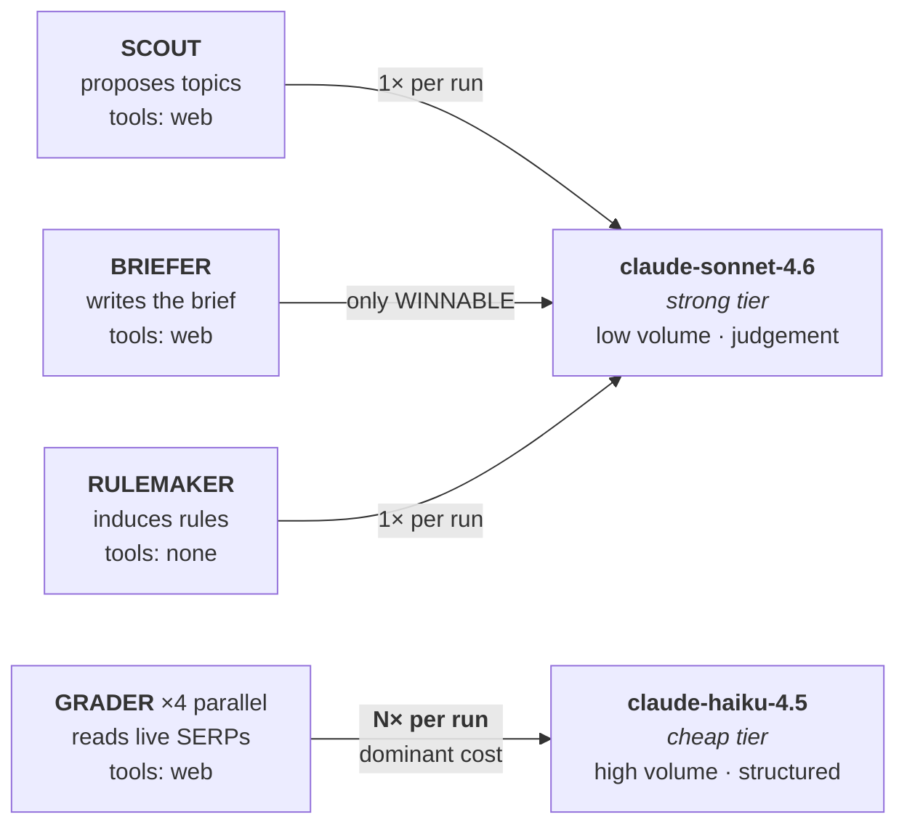

# cairn

**An SEO agent that gets cheaper and sharper every run, because MongoDB remembers what didn't work.**

Built at the MongoDB Persistent Context Sprint Hackathon · 2026-08-13

> A cairn is a stack of stones marking a trail, so the next traveler doesn't re-explore the dead ends.

---

## The thesis

Most AI SEO tools are stateless. Point one at your site twice and it does the same expensive research
twice, proposes the same topics, and cheerfully suggests an article you already published three
months ago.

Cairn stores every SERP verdict, every duplicate collision, and every human rejection in MongoDB —
then uses that memory to **veto work before paying for it**.

> Measured on `plausible.io`: **22,359 tokens on run 1, 2,802 on run 2** — an 87% drop, with
> **10 of 10** candidates resolved from memory and zero live SERP reads paid for.

**This is the difference between RAG and memory.** A RAG app retrieves documents and stuffs them into
a prompt. Cairn retrieves and then **refuses to run the next stage**. Retrieval output here is
*control flow*, not prompt filler — which is also why this isn't another "basic RAG application."

---

## Architecture



**The only path that costs money runs through the gate.** Everything the system already knows is
answered from MongoDB for free.

Every stage checkpoints. `cairn run <domain> --resume <run_id>` continues mid-flight — see
[Crash recovery](#crash-recovery-verified), which is verified against a real `kill -9`.

---

## How we use MongoDB

MongoDB isn't a log here. It is the component that **decides what the agent does next.**

### State and memory are deliberately separate



A crash loses none of the run. Deleting the run loses none of the learning.

### Six MongoDB capabilities, each load-bearing

| Capability | Collection | What it decides |
|---|---|---|
| **Automated Embedding** | all three vector indexes | `autoEmbed` — documents carry text, Atlas generates and maintains the vectors. No embedding pipeline, no second API key |
| **Vector Search** ×3 | `pages`, `verdicts`, `rules` | Three separate indexes serving three *distinct* veto decisions |
| **Atlas Search** | `pages` | The lexical half of cannibalization detection |
| **Change Streams** | `verdicts` | Briefing starts the instant a winner lands, not when the batch ends |
| **Atomic `$inc`** | `rules` | Confidence updates as a database write — auditable, can't hallucinate |
| **Aggregation** | `runs ⋈ briefs ⋈ topics ⋈ verdicts` | Share of candidates resolved from memory, run over run — the headline metric |

#### 1. Three vector indexes, three different jobs — embedded by Atlas itself

Most projects have one vector index and call it memory. Ours has three because there are three
genuinely different questions to ask before spending money:



Every veto writes the `_id` of the responsible document to `topics.vetoedBy`, so the terminal can
show **which stored fact killed which topic** — the thing that makes memory legible instead of magic.

#### 2. Hybrid search, because cannibalization needs two signals

Cannibalization — two of your own pages fighting over one intent — is genuinely a two-signal problem,
and either signal alone misses half the cases:

- **Vector** catches *same intent, different words*: `"hybrid search"` vs `"combining BM25 and vectors"`
- **Atlas Search** catches *literal keyword collision* on `targetKeyword`, which a semantic model
  often scores as merely similar rather than identical

It searches `targetKeyword` **only**, and that restriction is load-bearing. Including `title` and
`h1` let a long query pile up common-token matches: `"bounce rate removed in GA4 what to use
instead"` scored **6.08** against an unrelated post, *above* the genuine collision
`"plausible vs matomo"` → `/vs-matomo` at **5.65**. No threshold separates those. Restricted to
`targetKeyword` the same pair splits cleanly at 2.34 vs 3.07.

```python
# gate.py — the lexical half, fuzzy so near-miss keyword targets still collide
{"$search": {
    "index": "pages_text",
    "compound": {
        "filter": [{"equals": {"path": "site", "value": site}}],
        "must":   [{"text": {"query": query,
                             "path": ["targetKeyword", "title", "h1"],
                             "fuzzy": {"maxEdits": 1}}}]}}}
```

#### 3. Change streams decouple grading from briefing

Verdict grading fans out across a thread pool. Rather than making the brief stage wait for the
slowest grader, a watcher on `verdicts` pushes each WINNABLE verdict downstream the moment it's
inserted:



The `$match` lives inside the pipeline, so the server filters and only winners cross the wire.
Where change streams aren't available, the watcher falls back to polling.

#### 4. Learning is a database write, not an LLM output

Rule confidence is never something a model asserts about itself. When induction produces a rule that
already exists semantically (≥ 0.93), we reinforce rather than duplicate:

```python
# store.py
db.rules.update_one({"_id": near[0]["_id"]},
                    {"$inc":  {"confidence": 0.05, "timesConfirmed": 1},
                     "$push": {"evidenceIds": run_id}})
```

Confidence is auditable, monotonic in evidence, and cannot inflate itself. Rules below 0.6 never fire.

#### 5. One aggregation is the whole scoreboard

`cairn stats` joins `runs` against `briefs`, `topics`, and `verdicts`. Real output from two
consecutive runs against `plausible.io`:

| run | start | considered | resolved from memory | paid SERP reads | tokens |
|---|---|---|---|---|---|
| `0eaaf51a` | cold | 10 | 9/10 (90%) | 1 | 22,359 |
| `659b6998` | warm | 10 | **10/10 (100%)** | **0** | **2,802** |

Note what this deliberately does *not* report: **tokens per brief.** As memory saturates a run
correctly produces fewer briefs, because less is genuinely new — so that ratio *rises* while the
system is working. We measured it going 9,358 → 30,370 across four runs and cut the metric. The
honest measure is the share of candidates answered with zero API calls.

Even on the cold run, 9 of 10 candidates were vetoed: the crawl populates `pages` before the gate
runs, so cannibalization detection pays for itself on run 1.

---

## Multi-model, multi-agent architecture

Four specialized Hermes agents, each with its own system prompt, its own toolset, and — critically —
**its own model tier.** Grading a SERP is high-volume, structured, and cheap to get right. Writing a
brief is low-volume and quality-sensitive. Paying frontier prices for the former funds nothing.



| Role | Model tier | Why |
|---|---|---|
| `SCOUT` | strong | Runs once per run, but must emit a long structured list. Reasoning-only models returned no visible content at all here, silently yielding zero candidates. |
| `GRADER` | cheap | Runs **N× per run** in parallel. The dominant cost centre — and reading a SERP is perception, not judgement. Still needs to emit visible JSON every time: one model we tried returned reasoning-only responses on ~25% of calls, storing garbage as durable memory. |
| `BRIEFER` | strong | Runs only for WINNABLE topics. Differentiated angle and information gain are exactly where model quality shows. |
| `RULEMAKER` | strong | Once per run. Bad generalizations poison every future run, so this is the worst possible place to economize. |

Every tier is overridable — `CAIRN_VERDICT_MODEL`, `CAIRN_BRIEF_MODEL`, `CAIRN_RULE_MODEL` — so the
routing is a default, not a hard-coding.

### What we turned *off* in Hermes is the point

```python
AIAgent(
    model=self.model,
    enabled_toolsets=["web"],      # live SERP reads, with tool retries handled for us
    ephemeral_system_prompt=...,   # the role
    skip_memory=True,              # ← MongoDB is the memory
    skip_context_files=True,       # ←
    skip_background_review=True,
    quiet_mode=True,
)
```

**We replaced Hermes's private, local, single-session memory with a shared, queryable, cross-run
memory in MongoDB.** Hermes supplies reasoning and web tools; everything it durably learns lives in
Atlas, where the next run — on any machine, by any teammate — can query it.

Two further details that matter:

- **`run_conversation()` returns the full message list**, which we persist to `runs.trajectories` and
  replay via `conversation_history=` on resume. A resumed run picks up *mid-conversation* with its
  reasoning intact, rather than restarting the stage from a cold prompt.
- **A fresh `AIAgent` per thread.** Instances aren't thread-safe, so the grader pool constructs one
  per worker. `task_id` is set to `{run_id}:{stage}` so every Hermes call correlates back to a document.

---

## The SEO, specifically

Real practitioner mechanics, not heuristics invented to make a demo work:

- **Cannibalization detection.** Two of your own pages competing for one intent splits link equity and
  confuses the ranker. It's the most valuable thing an AI content pipeline can do — and the thing they
  universally fail at, because they publish the collision.
- **SERP difficulty read.** If official documentation and Wikipedia own a definitional query, a
  marketing site does not win it. The grader reads what actually ranks and in which *format*.
- **Intent matching.** Informational / commercial-investigation / transactional. Mismatch means no rank
  regardless of content quality.
- **Topical authority.** Only pursue topics adjacent to clusters the site already covers, derived from
  the `pages` embeddings rather than asserted.
- **Internal links that are real.** Brief link targets are retrieved from the site's own inventory by
  vector search. They came out of the database, so they cannot be hallucinated.

The output is a **brief, not a draft.** The human gate stays before publication — automating research
is one thing, blindly publishing is where quality drift and SEO self-harm start.

---

## Crash recovery, verified

Checkpointing is only worth claiming if it survives a real crash, so this was tested by killing the
process mid-grading with `kill -9` — not by a graceful stop.

```
CAUGHT: 3 of 8 verdicts done -> umami.is-bd3b6ef0
CONFIRMED DEAD
verdicts before resume: 3   briefs before resume: 0

$ cairn run umami.is --resume umami.is-bd3b6ef0
resuming umami.is-bd3b6ef0 from stage verdicts
  3 verdict(s) already in MongoDB from before the crash — not re-grading them
  ...5 remaining graded...
  recovered un-briefed winner: umami analytics vs plausible
  change stream delivered 4 WINNABLE verdict(s) to the brief stage

verdict docs=8  distinct queries=8  -> NO DUPLICATES
```

Two things had to be right for that, and neither came free:

- **Stage checkpoints are too coarse on their own.** The run resumes at the `verdicts` stage, but
  grading is per-topic — a naive resume re-pays for every verdict already completed. The verdicts
  already in MongoDB *are* the record of what finished, so the stage filters against them. This is
  the project's own thesis applied to itself.
- **Change streams only fire on insert.** A topic graded WINNABLE *before* the crash would never
  reach the brief stage on resume, because no new insert happens for it. The stage now sweeps for
  winners that still have no brief and recovers them.

Hermes conversations are persisted to `runs.trajectories` and replayed via `conversation_history=`,
so a resumed agent continues with its reasoning intact rather than restarting from a cold prompt.

## Multiple sites

One installation tracks any number of domains, and each keeps its own separate memory. Every
document carries a `site` field, every read is filtered by it, and all three vector indexes declare
`site` as a filter field — so one client's pages, verdicts, and rules never influence another's
decisions. Verified: a query for a topic `plausible.io` covers returns **no matches** when asked
against `umami.is`.

```
$ cairn sites
site           pages   SERP verdicts   rules   briefs   pending   runs
plausible.io      40               1       1        0         0      2
umami.is           0               8       4        4         2      1
```

There is no shared cross-site memory, deliberately: SEO difficulty is a property of *a specific
site's authority in a specific niche*, so a verdict earned by one domain says nothing reliable
about another.

## Setup

Requires Python 3.12 and [uv](https://docs.astral.sh/uv/).

```bash
git clone <this repo> && cd cairn

# Hermes ships no wheel, so vendor it from source:
git clone --depth 1 https://github.com/NousResearch/hermes-agent.git vendor/hermes-agent

uv sync
cp .env.example .env      # MONGODB_URI + OPENROUTER_API_KEY (+ VOYAGE_API_KEY)

uv run cairn doctor       # verify credentials, connectivity, change-stream support
uv run cairn init --wait  # create collections and Atlas search indexes
```

## Use

```bash
uv run cairn run example.com                     # full pipeline
uv run cairn run example.com --resume <run_id>   # continue after a crash

uv run cairn sites                               # every site you're tracking

# Seeing what the agent produced and why
uv run cairn report example.com                  # ← standalone HTML: decisions, evidence, briefs
uv run cairn briefs example.com --full           # read the briefs in the terminal
uv run cairn review example.com                  # approve/reject; rejections become rules
uv run cairn memory example.com                  # rules and SERP verdicts it has stored
uv run cairn stats example.com                   # share resolved from memory, run over run
uv run cairn reset example.com                   # wipe memory, to demo a cold start again
```

## Degradation

Nothing hard-blocks on a missing optional dependency:

| Missing | Fallback | Cost |
|---|---|---|
| Atlas vector index still building | Loud warning; exact cosine scan when embeddings are client-side | With `autoEmbed` there are no stored vectors to scan, so the gate reports that it is running blind rather than returning zero matches |
| M10+ cluster for `autoEmbed` | `CAIRN_EMBED_BACKEND=voyage` (client-side) or `hash` | `hash` is lexical only — measured 0.507 on a near-duplicate pair, below any useful threshold |
| Provider usage data | ~4-chars-per-token estimate, shown with a `~` prefix | OpenRouter usage reporting is provider-dependent and returned nothing on many calls; reporting 0 would have made the memory saving look infinite |
| Change streams | Polling the `verdicts` collection | ~1s added latency |
| Atlas Search index | Vector half of the gate still runs | Loses literal-keyword collision detection |

The vector-index case matters more than it looks: silently returning zero matches would read as
*"no duplicates found"*, the most dangerous possible failure mode for this system. That is why it
warns instead of degrading quietly.

## Roadmap

Two features were scoped and deliberately not built — see [`docs/ROADMAP.md`](docs/ROADMAP.md):

- **Google Search Console as a fourth memory check.** Everything cairn knows today is external: what
  your sitemap claims and what Google shows the public. GSC is the one source of *your own* truth,
  and it enables the highest-value move in SEO — *"you already rank #8 for this, improve that page
  instead of writing a new one."* Cut because it requires OAuth and only works on sites you have
  verified, which would break the clone-and-point-at-any-domain property.
- **An author agent with scoped repository access.** A second Hermes agent that turns an *approved*
  brief into a pull request — create-only, inside one content directory, on its own branch, with no
  terminal. It ends at a PR, never a deploy: the human gate before publication is a design position,
  not an unfinished edge.

## License

MIT
